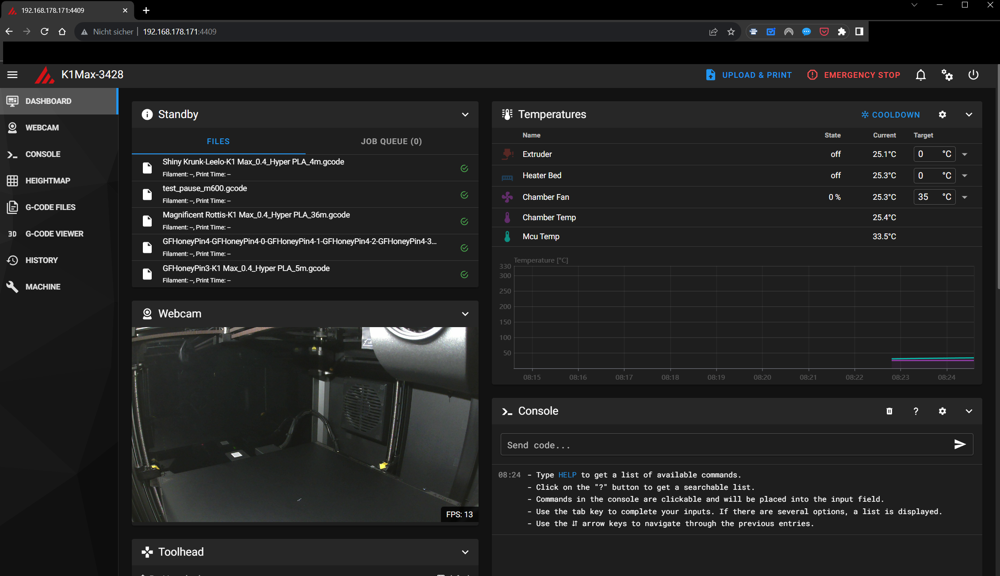
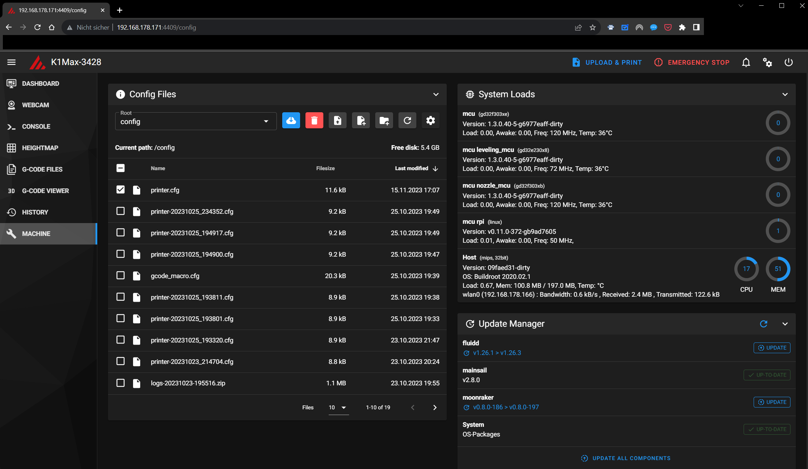
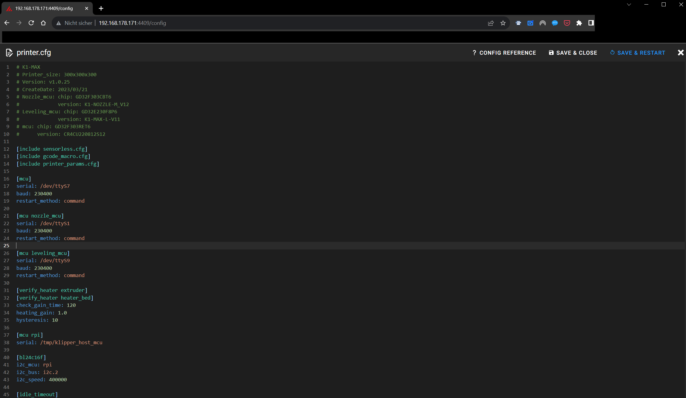
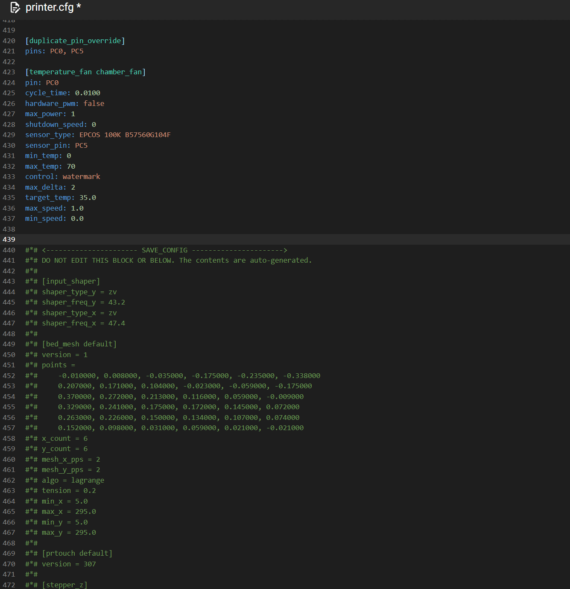

# Creality-K1-Max-Pause-Macro

## Purpose
This instrution will describe how to implement the required macros for the Creality K1 / K1 Max printers to be able to PAUSE and RESUME a print from GCODE, or from the Klipper UI like Mainsail.

## How it works
The K1 and K1 Max 3d printers are based on Klipper as a software. Klipper support several gcode commands, but does not implement [every possible g Code command](https://www.klipper3d.org/G-Codes.html). Therefore, we need to extend the GCODE commands to implement a PAUSE functionality.

To do this, we will implement the M0 gcode command [=unconditionally pause](https://marlinfw.org/docs/gcode/M000-M001.html). 
Once in place, wherever the M0 is inserted in a given GCODE, the printer will pause printing by executing our macro, move the printer head out of the way, and pause the print. 

A pause command can be used before test start of a new layer of a given print, for example. THen it is possible to exchange the filament, or insert parts into you current print or whatever needs to be done. Whenever ready, the print can be continued with macro RESUME_NOW, or use the Touchscreen and select continue.

## Limitations
While i write this instructions, creality print will not insert gcode to PAUSE a print, neither [M0](https://marlinfw.org/docs/gcode/M000-M001.html) nor [M600](https://marlinfw.org/docs/gcode/M600.html), even if the [software has such a function in place](https://www.reddit.com/r/crealityk1/comments/143svlm/anyone_try_out_filament_change_with_creality_print/?rdt=53952).

## How to insert PAUSE in a print

### Slicer
Cura is able to insert the correct gcode.
Prusa Slicer, too (untested).

### Prusa Tool
This tool will insert a M600 command:
[Prusa Color Print](https://blog.prusa3d.com/color-print_3993)

### Manual GCODE edit
Open your gcode file using a text editor. i recommend to use Notepad++.
search for gcode "layer", and find the right layer number where you want to add the pause.

Insert this:
...
M0
...
and save gcode and upload the file to your printer.

## Requirements
You need
- A Creality K1 / K1 Max :-)
- K1 / K1Max firmware installed, with root account enabled. If you dont know how to do it, please check this site how to get prepared: [Installation Helper Script for Creality K1 Series](https://github.com/Guilouz/Creality-K1-and-K1-Max).
- Mainsail installed. It should work with Fluidd - however, i did test it with Mainsail UI.

# Installation

## Access Printer UI

Access your printer's [web interface](https://github.com/Guilouz/Creality-K1-and-K1-Max/wiki/Access-to-Web-Interface)
To access the Mainsail Web Interface, just use your printer's IP address with port 4409 in your Web browser such as: http://xxx.xxx.xxx.xxx:4409/ (replacing xxx.xxx.xxx.xxx by your local IP address).



## Open printer.cfg

Select Machine:




## Edit printer.cfg

Open printer.cfg by clicking on it:



WARNING: Be careful with your printer.cfg. Consider making a copy of you current version and dowload it to your client, so you can go back anytime.
The mainsail ui will do that for you upon saving a new file version, too. You will find copies of older versions in the same folder.

Go to the very end of your printer.cfg, until you find similar code like this:



## Add Macro Code

Now, add the macro code block (see below) above the line <--- SAFE_CONFIG ---> :


```
> paste PAUSE Macro CODE here <

#*# <---------------------- SAVE_CONFIG ---------------------->
#*# DO NOT EDIT THIS BLOCK OR BELOW. The contents are auto-generated.
#*#
#*# [input_shaper]
#*# shaper_type_y = zv
#*# shaper_freq_y = 43.2
#*# shaper_type_x = zv
#*# shaper_freq_x = 47.4
#*#
```


MACRO code to be inserted before SAVE_CONFIG:
```
### ------------------------------------------ PAUSE MACROS START -----------------------------------

[gcode_macro M0]
gcode:
  PAUSE

[gcode_macro M600]
gcode:
  PAUSE

[gcode_macro RESUME_NOW]
gcode:
  RESUME

[gcode_macro PAUSE_NOW]
gcode:
  PAUSE


[idle_timeout] 
timeout: 120
gcode:
    
        M118 Bypassed Timeout
        M117 Bypassed Timeout
    
        M118 Timeout Reached - Heaters and Motors Still On!
        M117 Timeout Reached - Heaters and Motors Still On!
        #TURN_OFF_HEATERS
        #M84
    


[gcode_macro PAUSE]
description: Pause the actual running print
rename_existing: PAUSE_BASE
# change this if you need more or less extrusion
variable_extrude: 1.0
gcode:
  ##### read E from pause macro #####
  
  ##### set park positon for x and y #####
  # default is your max posion from your printer.cfg
  
  
  ##### calculate save lift position #####
  
  
  
      
  
      
  
  ##### end of definitions #####
  PAUSE_BASE
  G91
  
    G1 E-{E} F2100
  
    {action_respond_info("Extruder not hot enough")}
  
  
    G1 Z{z_safe} F900
    G90
    G1 X{x_park} Y{y_park} F6000
  
    {action_respond_info("Printer not homed")}
   

[gcode_macro RESUME]
description: Resume the actual running print
rename_existing: RESUME_BASE
gcode:
  ##### read E from pause macro #####
  
  #### get VELOCITY parameter if specified ####
  
    
  
    
  
  ##### end of definitions #####
  
    G91
    G1 E{E} F2100
  
    {action_respond_info("Extruder not hot enough")}
    
  RESUME_BASE {get_params}
### ------------------------------------------ PAUSE MACROS END -----------------------------------

```

# Sample STL + GCODE

[Sample STL](pause_sample_creality_print.stl)

[GCODE file with M0](pause_sample_creality_print.gcode)


